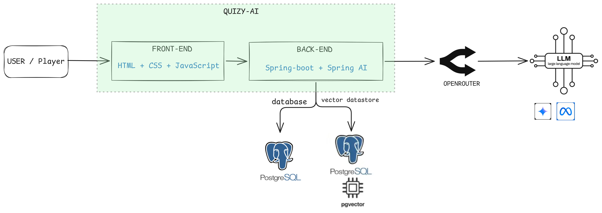
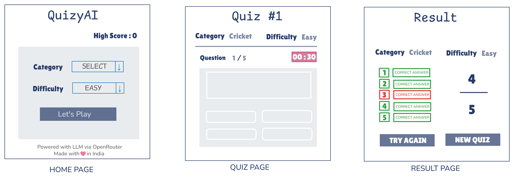
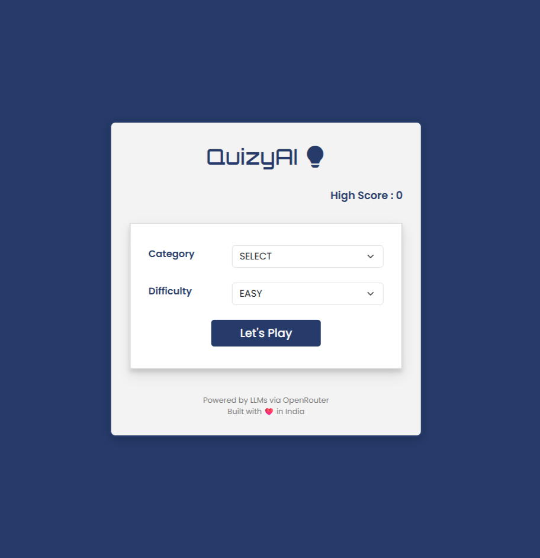
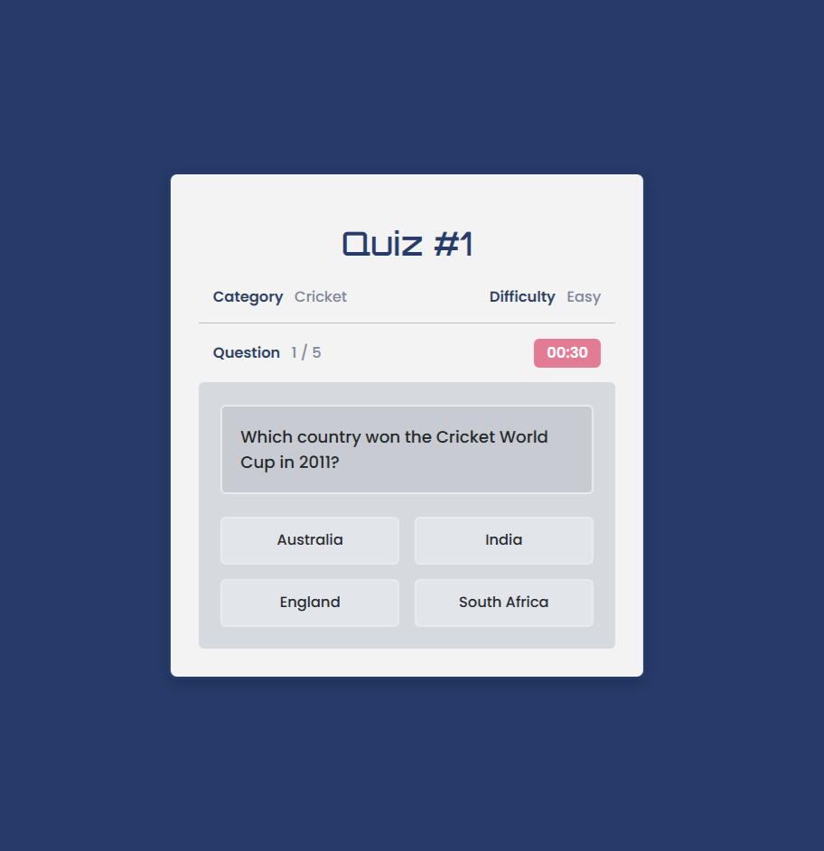
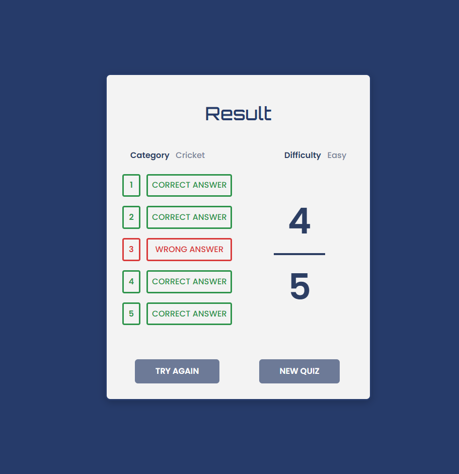

# QuizyAI 🤖🧠

> 🚧 **Work In Progress**

**QuizyAI** explores a simple idea:

> *What if a quiz application didn’t need a database at all?*

QuizyAI is an **AI-powered quiz backend** built with **Spring Boot** and **Spring AI** that generates quiz questions dynamically using **Large Language Models (LLMs)** instead of retrieving them from a traditional database.

Most quiz platforms rely on storing thousands of questions, options, and answers in a datastore. QuizyAI takes a different approach — it **generates quizzes on demand using AI**, eliminating the need to maintain a large question bank.

The application integrates with **OpenRouter free LLM models** to generate quizzes for **any topic in real time**.

This project is primarily a **learning playground** to explore how **AI can be integrated into Java/Spring backend systems**.

---

### ✨ Core Idea

```
User Request → Prompt AI Model → Generate Quiz → Send Quiz
```

No stored questions.
No question management system.
Just **AI generating quizzes dynamically**.

---

### 🚀 Features

- 🤖 **AI-Generated Quizzes** Create quizzes for any topic or category in real time
- 🎯 **Configurable Difficulty** Supports difficulty levels like `easy`, `medium`, and `hard`
- 🔀 **Automatic Shuffling** Randomizes questions and options for a unique quiz each time
- 🔌 **LLM Integration** Uses free models via **OpenRouter**
- 🔁 **Retry Mechanism** Handles API rate limit failures gracefully
- ⚡ **Modern Java Backend** Built with **Spring Boot + Spring AI**
- 🧾 **Structured AI Responses** AI returns quiz data in JSON format
- 🌐 **Web or mobile frontend**

---


### ⚠️ Disclaimer

Since quizzes are generated by AI models:

- Some questions may occasionally be **incorrect or ambiguous**
- Output consistency depends on the **LLM being used**

This project focuses on **learning AI integration**, not building a production-grade quiz platform.

---

### 💡 Why This Project Exists

Because the best way to understand AI isn’t just by reading about it —

**it’s by building something with it.**

---

### 🌐 API Endpoints

**Endpoint**

```
GET /quiz
```

Generates a **5-question quiz** for a given topic.

#### Query Parameters

| Parameter | Description | Default | Example |
|----------|-------------|--------|--------|
| `category` | Quiz topic/category | - | `Science` |
| `difficulty` | Difficulty level | `easy` | `medium` |

#### Example Request

```http
GET http://localhost:8080/quiz?category=Science&difficulty=medium
```

---

### 🛠 Tech Stack

| Technology         | Purpose                   |
|--------------------|---------------------------|
| **Java**           | Core backend language     |
| **Spring Boot**    | Backend framework         |
| **Spring AI**      | LLM integration           |
| **OpenRouter**     | Access to free LLM models |
| **Maven**          | Dependency management     |
| **JSON**           | Structured AI responses   |
| **HTML, CSS & JS** | Frontend Stack            |

---

### 🎯 Purpose of the Project

QuizyAI is intentionally designed as an **experimental learning project**.

The goals are to explore:

- Integrating **LLMs with Java applications**
- Using **Spring AI for AI-powered backends**
- **Prompt engineering** for structured responses
- Parsing and validating **AI-generated JSON**
- Understanding how **AI can replace traditional data sources in some scenarios**

---

### ▶️ Running the Project

#### 1. Clone the repository

```bash
git clone https://github.com/jaydeepsahu1609/QuizyAI.git
cd QuizyAI
```

#### 2. Create Environment File

```bash
cp .env.template .env
```

#### 3. Add OpenRouter API Key

Edit the `.env` file:

```
SECRET_API_KEY="your_openrouter_api_key"
```

#### 4. Start the Application

Run using the provided script:

```bash
./startup.sh
```

Or run directly from **IntelliJ IDEA**.

Make sure your run configuration loads environment variables from the `.env` file.

---

### 🔮 Future Improvements

- AI response validation and retry mechanisms
- Better prompt engineering for consistent quiz format
- Rate limiting and caching of generated quizzes
- 👤 **User management** with quiz history
- 🏆 **High score tracking**
- 💾 **Save progress** and resume quizzes
- **Timer** for the quiz
- Support for multiple AI providers
- 📊 Quiz analytics and performance insights

---

### Architecture Diagram



---
### 🎨 UI & Design

To visualize how the AI-powered quiz would look for end users, I have designed a basic UI wireframe. You can find the high-resolution screenshots and design assets in the `docs/` folder.

#### Wireframe Preview


#### UI Previews





#### Demo

> **Note:** Since this project utilizes free LLM models via OpenRouter, AI response times may be slightly higher.

[](docs/QuizyAI-Demo-March7.mp4)

*Click the image above to view the demo video.*

---